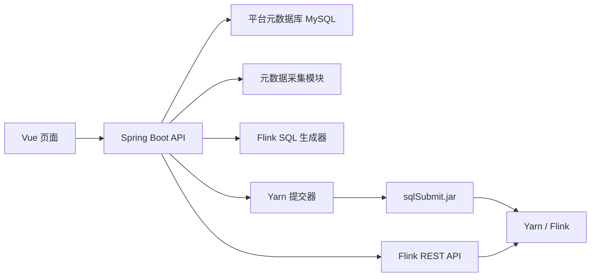

# 平台架构

## 目标

建设一个轻量级 Flink 同步平台。用户可以在页面上创建数据源、浏览来源表、生成 Flink SQL、提交任务到 Yarn，并查看任务运行状态。

## 第一阶段 Connector 范围

来源端：

- MySQL JDBC 批查询
- Datagen

目标端：

- MySQL JDBC
- Kafka
- Print

内置数据源：

- `datagen`
- `print`

Kafka 第一阶段只作为目标端，因此用户暂时不需要维护 Kafka source 字段结构。

## 总体流程



## 后端模块

### datasource

负责数据源定义和连接测试。

职责：

- 新增、修改、删除数据源。
- 加密和解密数据源密码。
- 测试 MySQL 和 Kafka 连接。
- 提供内置 `datagen` 和 `print` 数据源。

### metadata

负责采集和保存表元数据。

职责：

- 查询 MySQL 表列表。
- 通过 JDBC 元数据或 `SHOW FULL COLUMNS` 读取 MySQL 字段。
- 将来源字段类型映射为 Flink SQL 类型。
- 保存表和字段元数据。

### sql-generator

根据结构化任务配置生成可执行的 Flink SQL。

职责：

- 生成 source `CREATE TABLE`。
- 生成 sink `CREATE TABLE`。
- 生成 `INSERT INTO ... SELECT ...`。
- 保证字段映射稳定、可预览、可审查。

### job

负责同步任务定义、版本和提交记录。

职责：

- 保存草稿任务。
- 生成 SQL 预览。
- 保存生成后的 SQL 版本。
- 提交、取消、查询任务实例。

### yarn

通过 Flink CLI 将生成后的 SQL 任务提交到 Yarn。

职责：

- 写入生成后的 SQL 文件和 job properties 文件。
- 拼接 `flink run` 命令。
- 尽量解析 Yarn application id 和 Flink job id。

### flink-rest

通过 Flink REST API 查询任务状态。

职责：

- 查询任务运行状态。
- 查询异常信息。
- 查询 checkpoint 概况。

## 执行模型

平台生成任务文件，例如：

```text
generated/sql/job_1001_v3.sql
generated/prop/job_1001_v3.properties
```

然后提交：

```bash
flink run \
  -m yarn-cluster \
  -ynm user_job_name \
  -yqu default \
  /opt/sqlsubmit/sqlSubmit.jar \
  --sql /opt/sqlsubmit/generated/sql/job_1001_v3.sql \
  --job.prop.file /opt/sqlsubmit/generated/prop/job_1001_v3.properties
```

## 平台配置

这些配置属于平台后端自身，不属于生成后的 Flink SQL：

```properties
flink.home=/opt/flink
sqlsubmit.jar.path=/opt/sqlsubmit/sqlSubmit.jar
generated.sql.dir=/opt/sqlsubmit/generated/sql
generated.prop.dir=/opt/sqlsubmit/generated/prop
yarn.queue=default
flink.rest.url=http://flink-jobmanager:8081
main.class=com.rookie.submit.main.SqlSubmit
submit.enabled=false
submit.timeout.seconds=120
```

`submit.enabled=false` 时只生成 SQL/properties 文件和提交命令，不执行外部 `flink run`。这适合本地开发和页面联调。

## 关键设计选择

- 任务保存为“结构化配置 + 生成后的 SQL”。
- 生成 SQL 要版本化。每一次提交都指向一个不可变 SQL 版本。
- Kafka 第一阶段只作为 sink，避免引入 source schema 推断复杂度。
- MySQL CDC 后续作为 MySQL source 的一种模式扩展，不单独设计一套平台模型。
